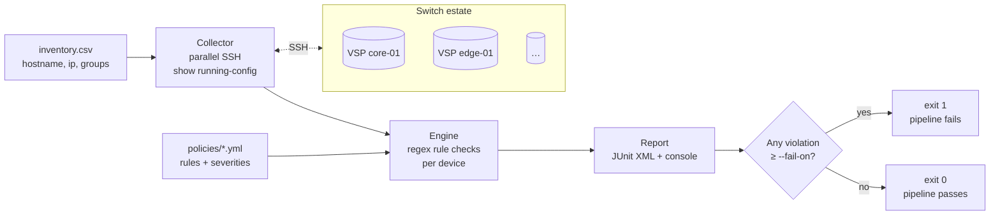

<div align="center">

# voss-audit

**Automated policy-compliance auditing for Extreme Networks VOSS / VSP switches, built for GitLab CI/CD.**

*Connect over SSH → read the running configuration → check it against versioned YAML rules → publish a JUnit report your pipeline can gate on.*

Read-only by design · parallel · fault-isolated per device · two dependencies

</div>

---

## Table of contents

- [What it does](#what-it-does)
- [How it works](#how-it-works)
- [Why it looks the way it does](#why-it-looks-the-way-it-does)
- [Requirements](#requirements)
- [Installation](#installation)
- [Configuration](#configuration)
  - [1. Inventory (CSV)](#1-inventory-csv)
  - [2. Credentials](#2-credentials)
  - [3. Policy rules (YAML)](#3-policy-rules-yaml)
- [Running it](#running-it)
- [Understanding the output](#understanding-the-output)
- [GitLab CI/CD integration](#gitlab-cicd-integration)
- [Shipped policy packs](#shipped-policy-packs)
- [What you must do manually](#what-you-must-do-manually)
- [Writing your own rules](#writing-your-own-rules)
- [CLI reference](#cli-reference)
- [Development](#development)
- [Project layout](#project-layout)
- [Scope & limitations](#scope--limitations)

---

## What it does

`voss-audit` is a command-line tool that answers one question across your whole switch
estate, automatically and on a schedule:

> *"Do the switches actually match the configuration policy we say they should?"*

It logs in to each switch listed in a CSV inventory, runs `show running-config`, and
evaluates the returned text against a set of **declarative YAML rules** — for example
*"telnet must be disabled"*, *"SSH must be enabled"*, *"no default SNMP communities"*,
*"every fabric node must have an SPBM nick-name"*. Each rule carries a **severity**, and
the tool exits non-zero when any violation reaches a threshold you choose — which is what
lets a GitLab pipeline **fail** and alert you when a device has drifted out of compliance.

The typical deployment is a **nightly scheduled pipeline** that audits the entire estate
and turns configuration drift into a red pipeline with a per-device, per-rule breakdown in
GitLab's native **Tests** tab.

**Key properties**

| | |
|---|---|
| **Read-only** | It only ever runs `show`-style commands. It never writes to, reboots, or reconfigures a device. There is no remediation path that touches hardware. |
| **Fault-isolated** | Every device is collected and evaluated independently. An unreachable, timed-out, or auth-failed switch is reported as an error — it never aborts the audit of the others. |
| **Parallel** | Devices are contacted concurrently via a thread pool (`--workers`, default 10), so auditing hundreds of switches stays fast. |
| **Severity-gated** | Rules are `info` / `low` / `medium` / `high` / `critical`. You decide the severity at which the pipeline should fail (`--fail-on`, default `high`). |
| **Versioned policy** | Rules and inventory are plain files in Git. Changing policy is a reviewable merge request, not a click in a GUI. |
| **Light** | Two third-party dependencies ([netmiko](https://github.com/ktbyers/netmiko) for SSH, [PyYAML](https://pyyaml.org/) for rules). Everything else is the Python standard library. No database, no daemon, no state. |

---

## How it works



1. **Inventory** — the CSV is parsed into a list of devices, each with an optional set of
   groups (e.g. `fabric`, `core`).
2. **Collection** — a thread pool opens an SSH session to every device and captures the
   running configuration. Failures are caught per device.
3. **Evaluation** — for each device, the engine selects the rules that apply to it (rules
   targeting `all`, plus rules targeting any of the device's groups) and runs their regex
   checks against the config text.
4. **Reporting** — results are printed as a compact console table and, optionally, written
   as JUnit XML for GitLab.
5. **Exit code** — drives the pipeline's pass/fail state.

---

## Why it looks the way it does

The rules match **raw configuration text with regular expressions** rather than parsing
VOSS config into a structured model. That is deliberate: it keeps the tool tiny and lets a
network engineer add a rule by writing one regex, with no Python and no parser to maintain.
The trade-off is that patterns must be written against your firmware's actual output — see
[What you must do manually](#what-you-must-do-manually).

---

## Requirements

- **Python 3.10+**
- **Network reachability** from wherever the tool runs (your laptop, or a GitLab runner) to
  the **management IPs** of the switches, over **SSH (tcp/22)**.
- A **read-capable login** on the switches (running-config access is enough; no write
  privileges are needed).

---

## Installation

Plain `pip` — no special tooling required.

```bash
# from the repository root
pip install .
```

This installs the `voss-audit` command. For a development checkout, see
[Development](#development).

---

## Configuration

Three things are configured, all as files/variables you control: **which** devices, **how**
to log in, and **what** to check.

### 1. Inventory (CSV)

`inventory.csv` lists the switches to audit. A header is required; the `groups` column is
optional.

```csv
hostname,ip,groups
core-01,10.0.0.1,fabric;core
core-02,10.0.0.2,fabric;core
edge-01,10.0.10.1,
edge-02,10.0.10.2,
```

- **hostname** — a label used in reports (does not need to be DNS-resolvable).
- **ip** — the management address the tool connects to.
- **groups** — zero or more tags, separated by `;` (or a `,` inside a quoted field).
  Groups drive rule targeting: a device tagged `fabric` receives the fabric rules on top of
  the baseline; an untagged device receives only rules that target `all`.

> Tag your SPBM/fabric nodes with `fabric` so they pick up the fabric-consistency pack.
> Everything else can be left untagged and still gets the full security baseline.

### 2. Credentials

Credentials are read from environment variables — they are **never** stored in the repo:

```bash
export VOSS_USERNAME=auditor
export VOSS_PASSWORD='…'
```

In GitLab these become **masked** CI/CD variables (see below).

### 3. Policy rules (YAML)

Every `*.yml` / `*.yaml` file in the `policies/` directory is loaded and the rules are
merged (rule IDs must be unique across all files). A rule is:

```yaml
rules:
  - id: SEC-001                              # unique identifier, shown in reports
    description: Telnet must be disabled     # human-readable, shown in reports
    severity: critical                       # info | low | medium | high | critical
    groups: [all]                            # optional; default [all]
    match_absent: '^boot config flags telnetd'   # this pattern must NOT appear
  - id: FAB-003
    description: SPBM nick-name must be assigned
    severity: high
    groups: [fabric]                         # only devices tagged 'fabric'
    match_present: '^spbm \d+ nick-name'     # this pattern MUST appear
```

Each rule needs `id`, `description`, `severity`, and at least one of:

- **`match_present`** — one regex, or a list of regexes, that **must** match the config.
- **`match_absent`** — one regex, or a list, that **must not** match.

Patterns are evaluated with `re.MULTILINE`, so `^` and `$` anchor to the start/end of a
line — this is what makes `^boot config flags telnetd` reliably match a real config line
without also matching `no boot config flags telnetd`.

---

## Running it

Validate your inventory and rules **without touching any device** (great as a first step
and as a CI gate on policy changes):

```bash
voss-audit --lint
```

Audit everything and write a report:

```bash
voss-audit --inventory inventory.csv --policies policies/ --junit report.xml
```

Audit a single switch while you're tuning rules:

```bash
voss-audit --host core-01
```

Audit only your fabric nodes:

```bash
voss-audit --group fabric
```

---

## Understanding the output

**Console** — a per-device summary followed by a list of every violation and every
unreachable device, so the pipeline log is readable on its own:

```
Device    Rules  Passed  Failed  Status
------------------------------------------------
core-01      16      16       0  OK
edge-01      10       7       3  FAIL
down-01       -       -       -  ERROR: TimeoutError: connect timed out

Violations (3):
  [CRITICAL] edge-01  SEC-001: Telnet must be disabled
             forbidden pattern '^boot config flags telnetd' matched: 'boot config flags telnetd'
  ...
```

**JUnit XML** (`--junit`) — one test suite per device, one test case per rule, so results
appear natively in GitLab's pipeline **Tests** tab and the merge-request widget. Unreachable
devices show up as errored test cases.

**Exit codes**

| Code | Meaning |
|:---:|---|
| `0` | All good — no violation at or above the `--fail-on` threshold, every device reachable. |
| `1` | One or more violations at/above the threshold, **and/or** one or more devices could not be reached. |
| `2` | Usage or configuration error (bad inventory, invalid rule file, missing credentials, unknown `--host`). |

---

## GitLab CI/CD integration

The shipped `.gitlab-ci.yml` defines two jobs on the `python:3.12-slim` image:

| Job | When it runs | What it does | Touches switches? |
|---|---|---|:---:|
| **lint-policies** | Merge requests, and pushes to the default branch | `voss-audit --lint` — validates the inventory and rule files so a broken policy can't be merged | No |
| **compliance-audit** | **Scheduled** pipelines and **manual** (web-triggered) runs | The real audit; uploads `report.xml` as a JUnit artifact | Yes |

Splitting them means every merge request is checked for free without ever contacting a
device, while the live audit runs on your schedule against real hardware.

---

## What you must do manually

The code is ready to run, but a compliance tool is only as correct as the policy and access
you give it. Work through this checklist before trusting a green pipeline:

1. **Populate the real inventory.** Replace the example `inventory.csv` with your actual
   switches. Tag SPBM/fabric nodes with `fabric` (and any other groups you want to target).

2. **Validate the shipped rule patterns against *your* firmware.** This is the most
   important step. `show running-config` on VOSS **only prints non-default settings**, and
   the exact wording varies between VOSS/VSP releases. A rule that expects a line your
   firmware phrases differently will produce a **false positive**; a rule looking for the
   absence of something your firmware never prints will produce a **false sense of
   security**. To calibrate:

   ```bash
   voss-audit --host <one-representative-switch> --junit check.xml
   ```

   Read the report, compare against the device's real config, and adjust the regexes in
   `policies/*.yml` until the pass/fail verdicts are correct. Treat the shipped packs as a
   **starting baseline, not a certified benchmark.**

3. **Provision a read-only audit account** on the switches and set `VOSS_USERNAME` /
   `VOSS_PASSWORD`. A login with running-config read access is sufficient — the tool never
   needs write privileges.

4. **Configure GitLab CI/CD variables.** In **Settings → CI/CD → Variables**, add
   `VOSS_USERNAME` and `VOSS_PASSWORD` as **Masked** (and **Protected** if your audit only
   runs on protected branches).

5. **Give a runner network access to the management plane.** The `compliance-audit` job runs
   on a GitLab runner, so **that runner** must be able to SSH to the switch management IPs.
   If only some runners sit in the right network segment, add a runner tag and set `tags:`
   on the job.

6. **Create the schedule.** In **CI/CD → Schedules**, add a pipeline (e.g. nightly). Only
   scheduled and manual pipelines run the live audit, so nothing hits the switches until you
   do this.

7. **Decide your failure threshold.** The default is `--fail-on high`. Tighten it to
   `medium`, loosen it, or use `never` for an initial observation phase — edit the flag on
   the `compliance-audit` job in `.gitlab-ci.yml`.

8. *(Optional)* **Tune concurrency.** If your management plane is sensitive, lower
   `--workers`; to audit a very large estate faster, raise it.

---

## Writing your own rules

Add a new file under `policies/`, or extend an existing pack. A few patterns cover most real
checks:

```yaml
rules:
  # Something must be present:
  - id: LOG-001
    description: At least one syslog server must be configured
    severity: medium
    match_present: '^syslog host \d+ address '

  # Something must be absent:
  - id: SEC-020
    description: No plaintext HTTP management
    severity: high
    match_absent: '^web-server enable'

  # Several things must all be present (list = all must match):
  - id: NTP-001
    description: NTP must be enabled and have a server
    severity: medium
    match_present:
      - '^ntp$|^ntp enable'
      - '^ntp server '

  # Only applies to a group:
  - id: FAB-010
    description: vIST peer must be configured on fabric nodes
    severity: high
    groups: [fabric]
    match_present: '^virtual-ist peer-ip '
```

Run `voss-audit --lint` after editing — it validates every rule (unique IDs, valid
severities, compilable regexes) and reports how many rules apply to each device.

---

## CLI reference

```
voss-audit [options]
```

| Option | Default | Purpose |
|---|---|---|
| `--inventory PATH` | `inventory.csv` | Device CSV (`hostname,ip,groups`). |
| `--policies PATH` | `policies` | Rule directory (all `*.yml`) or a single file. |
| `--junit FILE` | – | Write a JUnit XML report to `FILE`. |
| `--workers N` | `10` | Number of parallel SSH connections. |
| `--timeout N` | `30` | SSH connect timeout, in seconds. |
| `--fail-on SEV` | `high` | Lowest severity that makes the run exit non-zero; `never` disables violation-based failure. |
| `--host H` | – | Audit only this device (repeatable). |
| `--group G` | – | Audit only devices in this group (repeatable). |
| `--show-command CMD` | `show running-config` | Command used to fetch the config. |
| `--lint` | – | Validate inventory and policy files only; no device access. |
| `-v`, `--verbose` | – | Verbose (INFO-level) logging. |
| `--version` | – | Print version and exit. |

Credentials always come from the `VOSS_USERNAME` / `VOSS_PASSWORD` environment variables.

---

## Development

```bash
python -m venv .venv && source .venv/bin/activate
pip install -r requirements-dev.txt
pip install -e .

pytest          # the toolkit's own tests — no network needed, uses config fixtures
ruff check      # lint
```

The test suite exercises the inventory parser, rule loader/validator, evaluation engine,
report writers, and the CLI end-to-end (with the SSH collector stubbed out), so you can
develop and verify rule logic entirely offline.

---

## Project layout

```
policy-compliance/
├── inventory.csv                    # your device list (example provided)
├── policies/
│   ├── security-hardening.yml       # baseline security rules (all devices)
│   └── fabric-consistency.yml       # SPBM/ISIS rules (group: fabric)
├── src/voss_audit/
│   ├── cli.py                       # argument parsing & orchestration
│   ├── inventory.py                 # CSV → Device objects
│   ├── rules.py                     # load & validate YAML rules
│   ├── collector.py                 # parallel SSH config collection (netmiko)
│   ├── engine.py                    # apply rules to config text
│   └── report.py                    # JUnit XML + console summary
├── tests/                           # pytest suite with offline config fixtures
├── .gitlab-ci.yml                   # lint + scheduled-audit pipeline
├── requirements.txt                 # runtime deps
├── requirements-dev.txt             # runtime + test/lint deps
└── pyproject.toml                   # package metadata / entry point
```

---

## Scope & limitations

- **Report-only.** By design it never changes device configuration. Remediation stays a
  human decision. There is intentionally no auto-fix path.
- **Regex over parsing.** Rules match config text; they do not build a semantic model of the
  device. Cross-object logic (e.g. "every VLAN referenced by an ACL exists") is out of scope
  for the YAML format — keep such checks in mind when designing policy.
- **Firmware-dependent patterns.** Because it reads `show running-config`, rules are tied to
  how your VOSS version renders configuration. Re-validate patterns after major firmware
  upgrades.
- **No persistence.** There is no database and no built-in trend history; each run is
  self-contained. Historical tracking, if you want it, comes from archiving the JUnit
  artifacts in GitLab.
